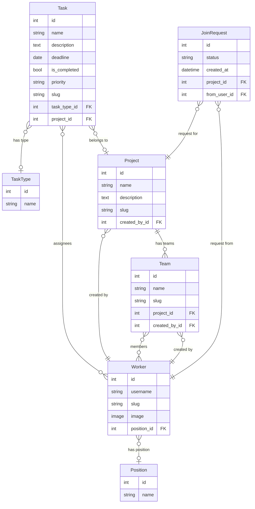

# TaskFlow

A task management web application built with Django. Organize teams, track tasks, and manage projects.

## Features

- Task creation with priority, deadline, and assignees
- Project and team management
- Join request system for projects
- Worker profiles with photos
- Task filtering and search

## Setup

**1. Clone the repository**
```
git clone <repository-url>
cd task_manager
```

**2. Create and activate a virtual environment**
```
python -m venv venv
venv\Scripts\activate        # Windows
source venv/bin/activate     # macOS/Linux
```

**3. Install dependencies**
```
pip install -r requirements.txt
```

**4. Apply migrations**
```
python manage.py migrate
```

**5. Create a superuser (optional)**
```
python manage.py createsuperuser
```

**6. Run the development server**
```
python manage.py runserver
```

Open your browser at `http://127.0.0.1:8000`

## Database Schema


